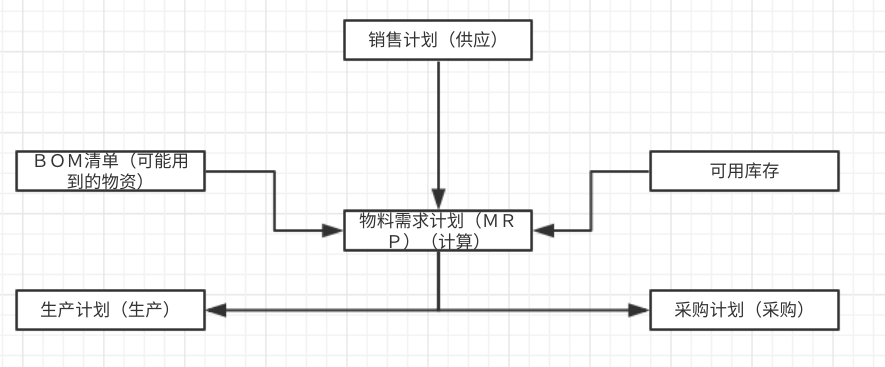

## 第一章、ERP概述

## 1、ERP起源

1. 课程安排流程：概述、历程、体系、模块、实施、**上机实践操作ERP软件**

   1. 概念（一到三章）：概述、理论形成、基本概念与生产类型；
   2. 图表计算题（四五章）：经营计划和主生产计划、物料需求和能力需求
   3. 销售管理（采购、库存）、车间管理（JIT生产）
   4. 公式计算题：财务管理（固定资产成本管理）
   5. 折旧习题：设备管理（质量管理）
   6. 离散、图论习题：分销资源管理、人力管理

2. 为**方便进行企业管理**而提出的**管理软件**ERP (**E**nterprise **R**esource **P**lanning)

3. ERP功能：

   - 生产资源、**信息、物流**管理
   - **供销存**：采购、销售、库存
   - **管人财物**：人力、物力、财力（成本、预算、结算）

4. ERP流程：**事前计划、事中控制、事后分析统计**

5. **工作流程实例**：订货-》售前沟通-》商务谈判-》达成协议-》订单计划（MPS计划（主生产计划Main ProductionSchedule））-》BOM（物料清单）-》毛需求、净需求、JIT-》企业鼓励批量购买-》顾客为省钱经济批量购买-》验收退料、换料-》工艺路线-》工作中心-》瓶颈工序管理（重要工艺做不出来了（made in China））-》产能不足-》紧急订单-》并购失败=》紧急采购-》采购跟催-》验收、入库、转应付账款-》紧急订货、要求现货-》成本核算（ABC成本法）-》盈利分析（收益-支出）-》现金预算、资金调配-》预测发展、增加产能

6. **ERP核心**：**采购、生产、销售**

   

7. 