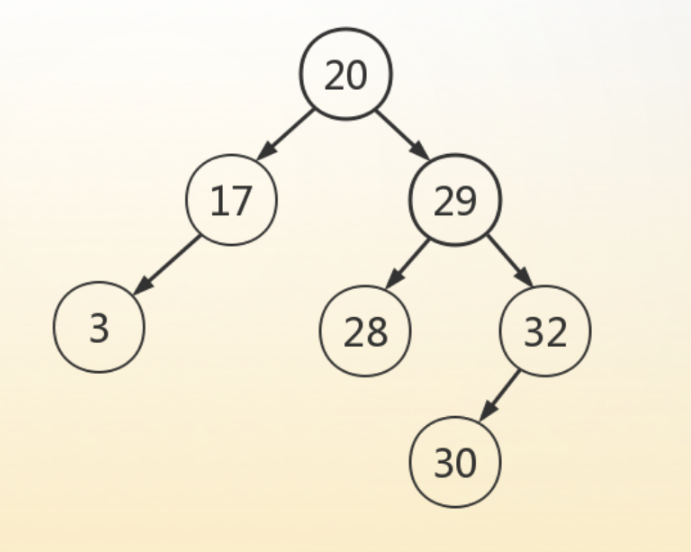
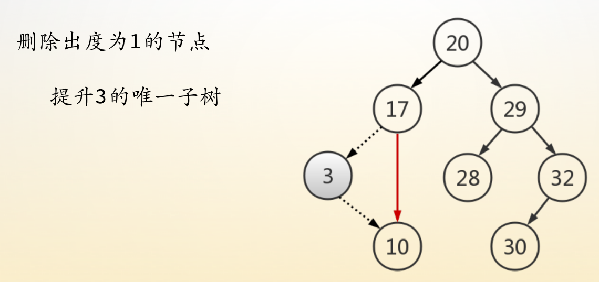
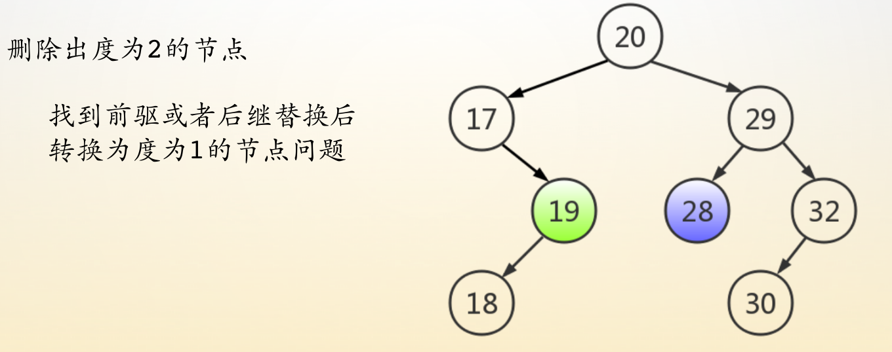
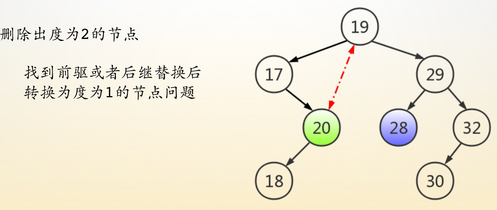
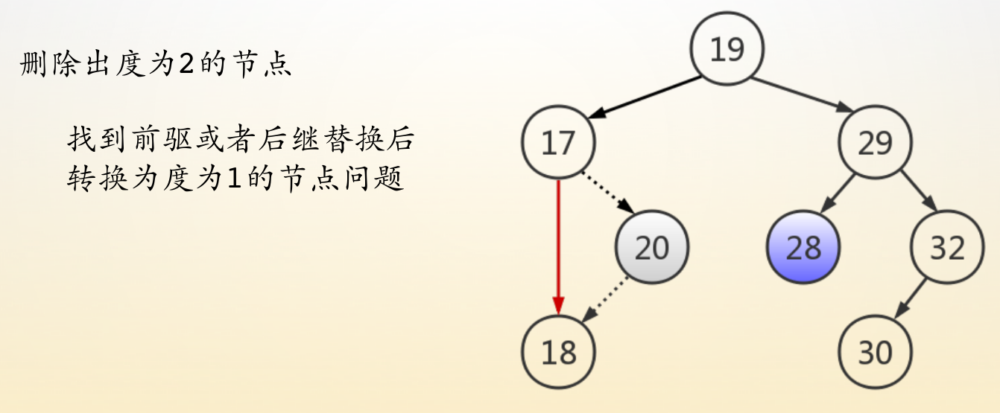

#  数据结构

## 引述

程序中的结构 + 思维逻辑的结构；

数据结构的本质：计算机可以看懂的数据的表示；

数据结构和算法相辅相成；

数据结构=结构定义+结构执行；

默认参数；


## 时间复杂度递小排序：


## 线性表

1、线性表中元素类型均相同；

2、线性表和顺序表的关系：线性表是逻辑结构，顺序表是存储结构；

（？）3、顺序表插入操作的时间复杂度：在第i位置插入元素，需平均移动多少个元素

4、顺序表扩容：先将元素存入临时空间，再将原来空间扩大为原来的2倍；

## 链表

- 链表插入元素的平均时间复杂度如何计算

- 每一个链表中的元素都得可以被一个小抓手索引到；
- 两种操作：插入 + 删除
- 单向循环链表：把`head`看做是整个单向循环链表的尾节点；

## 堆栈与队列

### 1、堆栈的应用场景：

- 用于编译器语法检查中的符号匹配

```c
建立一个空的堆栈。
    while( 文件没有结束 ) {
        读取一个字符。
        if 遇到一个左括号，把它入栈。
        else if 遇到右括号 then 检查堆栈，{
            if 堆栈为空 then 报告错误，终止程序（括号不匹配）。
            else if 堆栈非空 then {
                if 栈顶不是对应的左括号 
                	then 报错，终止程序。
                弹出栈顶。
            }
     	}
    	if 栈非空 then 报错。
    }
```

- 用于计算代数式
- 典型问题＝＝>括号匹配：括号之间的嵌套相当于事件的包含关系；
- 栈的本质：可以处理具有完全包含关系的问题；

### 2、**队列**

- 队列－－假溢出＝＝>循环队列；
- *单调队列* 的本质作用：维护滑动窗口内部的最值，这个区间也可以是变长区间；
- 单调递减队列：维护区间最大值；
- 单调递增队列：维护区间最小值；
- **单调队列应用举例**：
  - *问题描述*：在一个无序数组（无重复元素）中，找出连续的`5`个数，这`5`个数排完序之后是连续的`5`个数（顺子）；
  - *解决方案*：通过分析，我们可以得出这`5`个数有一个性质，就是最大值与最小值的差是`4`。我们可以将每五个数看做一组，找出这五个数当中的最大值和最小值，若差值为`4`，则代表我们找到了，可以借助滑动窗口来实现。找五个数中的最大值和最小值，若通过普通的比较查找，则需要比较`10`次，最终解决这个问题的时间复杂度是`O(10n)`；我们可以通过单调队列来维护这五个数的最大值和最小值，利用单调递减队列维护最大值，用单调递增队列维护最小值，这种方法中每一个元素最多进队列`1`次、出队列`1`次，两个队列，再乘以`2`，故这样解决问题的时间复杂度是`O(4n)`；下面我们介绍一种时间复杂度为`O(n)`的解法。
  - *BOSS*：我们知道，连续的`5`个数（顺子）排列组合的话也只有`120`种情况，我们可以将所有的情况列举出来，计算相邻两个数的差，也只有`120`种情况，将这些情况记录下来。然后我们扫描元素的时候（`5`个为一组），只需要计算相邻元素的差，并与我们记录的情况作对比就行了。接下来要解决记录与对比的问题，我们知道上面提到的差的范围为`[-4,4]`，我们为其加上`5`，变成`[0,9]`，也就是每两个数的差可以用`0~9`之间的一个数表示，一共有`4`个差，也就是一个`4`位数就可以表示一种情况，我们只需要开一个`10000`的数组来记录就行了，这时对比的时间复杂度就是`O(1)`。这样，我们解决这个问题的时间复杂度就是`O(n)`了。
  - *补充*：对于上述的*BOSS* 解法，如果是要找连续的`7`个数，则差的范围会变成`[-6,6]`，我们为其加上`7`，变成`[0,13]`，这时差的范围就大于`10`了，即每一位数字就大于`10`了，上述算法看似就不行了，不过别忘了我们并不是只能用十进制来表示一个数，这里我们可以用十四进制来表示每一个数，那么接下来的解法就类似了。当待求的连续的数的个数改变之后，只需换个进制来表示两个元素的差就行了。不过当待求的连续的数的个数太多时，我们就无法一一列举所有的情况了，这个算法就不适用了，就得退化到上述利用单调队列的解法，单调队列的解法是通用的。

### **3、堆与优先队列**

- **堆**：本质上是一棵完全二叉树，可以用连续的数组空间存储；
- **大顶堆**（堆顶元素为最大值）＆**小顶堆**（堆顶元素为最小值）；
- 插入元素：从堆尾插入，依次调整堆元素；
- 删除元素：从堆顶弹出，将最后一个元素放在第一个出堆元素的位置，调整堆元素；
- *堆排序*；
- **堆应用举例**：
  - *问题描述*：从`1`亿个数中找出最小的十个数；
  - *解决方案*：我们要从许多数中找出最小的十个数，可以通过维护一个元素个数为`10`的大顶堆来实现。这个大顶堆中，堆首元素是这十个元素中最大的，即这个大顶堆中的十个元素是目前最小的十个元素；然后依次扫描所有的元素，如果扫描到的元素比堆顶元素小，则替换进来，再维护一下堆，继续扫描，直到扫描完所有的元素。这时堆中剩余的十个元素即为最小的十个数。

## 树

###### 什么是树：

每棵非空树有且仅有一个节点；在树上从一个节点访问到另一个节点有且仅有一条路径；父亲节点可以有多个子孩子，除根节点外，其余节点均有且仅有一个父亲节点；根节点没有父亲节点，叶子节点没有孩子节点。

- 树的层次结构与人的思维方式类似；
- 树的节点代表集合，树的边代表关系；
- 链表是特殊的树形结构（一叉树）；
- 一颗树中，根节点表示第一层，树的层数表示树的深度；

###### ？什么是二叉树：

- 二叉树的五种基本形态：空二叉树、只有根节点的二叉树、只有左子树的二叉树、只有右子树的二叉树、左右子树都有的二叉树；
- 二叉树的**每层最多节点个数**排列开来为一个等比数列，{1，2，4，8，16，......}则第n层个数符合等比数列的通项公式，前n层的个数符合等比数列的求和公式。

- ？**二叉树中度为`０`的节点比度为`２`的节点多`１`个；**（该性质的应用场景、与红黑树是否有关）
- ？两种特殊的二叉树：完全二叉树和满二叉树（性质、附带的方式方法、应用场景）
- 二叉树的遍历：前序＝＝>根－>左－>右；中序＝＝>左－>根－>右；后序＝＝>左－>右－>根；
- 算法优化手段：*记录式改计算式*；（完全二叉树－－>数组存储）；
- **二叉树的广义表表示**：利用栈，左括号代表入栈，右括号代表出栈；以逗号分割，逗号左边的加在左子树，逗号右边的加在右子树；
- **哈弗曼编码**：最短带权路径；


1. **一个简单的开脑洞的问题**

   - **船长提的小问题**：
     - *问题描述*：你手里有两个手机，现在要你测出对于一个`100`层的高楼，手机最低在哪一层楼掉下会摔碎，最多最少测几次，即手机在`x-1`层掉下不会摔碎，在`x`层掉下会摔碎，那么这个`x`便是我们要找的。
     - *错误解法*：二分法。由于我们手机数量有限，得有手机才能测试，如果手机都摔碎了就无法测试了，所以这个方法不可行。
     - *解决方案*：首先我们来定义两个函数，`F(n)`代表测`n`层最多最少需要测几次；`F(x,n)`代表共需测到`n`层，第一次测第`x`层，最多最少需测几次；不难得出`F(n)`与`F(x,n)`的答案是相同的，即`F(100)=F(x,100)`，其中`F(100)`为我们的待求值。接下来我们来求这个函数的表达式，不难得出`F(x,n)=max(x,1+F(100-x))`，这是因为我们第一次测了`x`层之后，若手机坏了，则需从第`1`层开始，一层一层开始向上测，直到第二个手机也坏了，最坏的情况是测到第`x-1`层，这时共测了`x`次；若手机没坏，则我们继续求`F(100-x)`就行，即从`x+1`层开始测就行，这时`F(x,n)=1+F(100-x)`。由于我们要求最坏情况下测几次，故`F(x,n)`需取那两个值的最大值，而且我们知道`x`越大，`F(100-x)`就越小，故要使`F(x,n)`最小，则需`x`与`F(100-x)`都适中才行，所以我们取`x=1+F(100-x)`处的`x`值。那么下面我们来计算`F(100-x)`，我们知道`F(100-x)=F(x',100-x)`，我们也可以得到`F(x',100-x)=max(x',1+F(100-x-x'))`，与上面的分析一样，当`x'`等于`1+F(100-x-x'))`时才是我们要求的答案，此时有`F(x',100-x)=x'`，即`F(100-x)=x'`，又由于`x=1+F(100-x)`，所以我们可以得到`x'+1=x`，即第二次测的楼层数要比第一次的少一。有了上面这个结论就可以推导我们的公式了。我们不妨设共测了`n`次，最后一次肯定是测一层的，则共测了`1+2+3+...+n`层，即`n*(n+1)/2`层，我们需要这个值大于等于`100`，即`n*(n+1)/2 >= 100`，求解得出`n`的最小值是`14`，这就是我们要求的答案，即最多最少测`14`次。

2、静态查找表通常采用顺序查找、折半查找等算法；动态查找表通常采用二叉平衡树、B-树、哈希表来查找。

3、平均查找长度

注：Pi = 1/n

4、折半查找判定树（二叉判定树）：

### 二叉排序树



###### 插入操作：

从根节点进行插入，若比根节点小，插入左子树，比根节点大，插入右子树。

###### 删除操作：

1、删除叶子节点：直接进行删除即可。

2、删除出度为1的节点：引入小例子，一男士由一老父亲抚养成人，一天车祸夺去生命，老父亲把男士的儿子抱在怀里，说你爹就是我养大的，你就由我抚养吧。



3、删除出度为2的节点，以删除根节点20为例：

- 首先找到比根节点20小的最大的节点（找到该节点的前驱节点或后继节点）；
- 即根节点20左子树中的最右的节点；
  - 先找到根节点的左孩子；
  - 然后再找左孩子的右孩子，重复该操作；
  - 直至无右孩子为止；
- 该节点的出度只能为0（叶子节点）或为1（有一个左孩子）；
- 然后将根节点20和该节点进行交换；
- 即转化为删除出度为1的节点或叶子节点；








## 字符串

### 一、KMP


### 二、SUNDAY

Sunday算法相对于KMP算法反其道而行之，当匹配失败时，

### 三、SHIFT—AND


## 字典树

字典树：首先是一棵树，节点表示集合，边表示关系，所以字典树的边表示英文字母，节点表示英文单词，根节点代表全集。


用途：用于字符串的快速检索,字符串的快速排序与去重,文本的词频统计等。

##### 一、单词查找

##### 二、字符串排序：

先序遍历一棵字典树，从左至右依次输出单词，则是该树中所有单词按字典序的排序；时间复杂度为O(n)。而且也可以采用字典树给数字排序，但需要提前将1->01，否则根据ASCII码值，10会在2前面的。


## 双数组字典树

采用两个数组base数组和check数组来表示一颗字典树，base数组表示父亲可以找到他的孩子，check数组表示子节点对应的父节点，做亲子鉴定的，那如何表示该节点是否独立成词呢，可以再开一个数组通过下标来表示其对应的节点是否独立成词，但更好的做法是通过check数组的正负数来表示，负数表示独立成词，反正用的时候用绝对值就行了。


根据输入的单词直接制作双数组字典树：先将输入的单词按字典序排序，即可知道根节点有多少个子节点，例如看以a字母为开头的单词有多少个，即可知道以a为根节点的字典树有多少个子节点。

##### 二叉字典树转双数组字典树


# 稳定排序

##### 插入排序

逐字稿：以整型数组插入排序从小到大为例，将该数组分为已排序区和待排序区，依次将待排序区元素移动到已排序区，且每次将该元素依次和已排序区元素比较，直至遇到比他小的元素为止。


```c


```

##### 冒泡排序


## 附录：

1、定义指针变量时在系统控制的栈区随机分配空间，赋值时在堆区分配空间。

2、队列出元素对首标记后移，当队列满后，全部元素出队列，还可以加入队列元素嘛？

3、**船长语录**：

在所以算法种类中，跟位运算相关的算法理解难度是最高的；

面对一个问题的时候，不能靠猜，要靠推理；

数据结构可以将你锻炼成像计算机一样去思考问题；

算法中有数据结构，数据结构中有算法，两者分不开；

数据结构分两个层面：逻辑 + 物理；